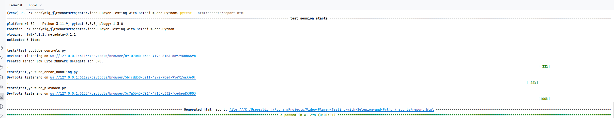
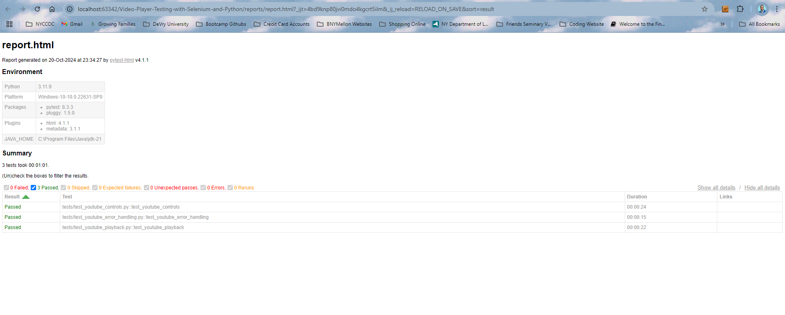

# Video Player Testing with Selenium on YouTube

This project demonstrates video player testing on YouTube using Selenium WebDriver in Python. It focuses on automating common test cases such as video playback, pause/resume controls, and volume control.

## Features
- Video playback testing
- Pause/Resume testing
- Volume control testing

## Setup Instructions

### Prerequisites
- Python 3.11
- Chrome WebDriver (or appropriate WebDriver for your browser)

### Installation

1. Clone the repository:
   ```bash
   git clone https://github.com/JUnelus/Video-Player-Testing-with-Selenium-and-Python.git
    ```

2. Create and activate a virtual environment:
    ```bash
    python -m venv venv
    source venv/bin/activate  # On Windows: venv\Scripts\activate
    ```
3. Install the required dependencies:
    ```bash
    pip install -r requirements.txt
    ```
4. Run the tests:
    ```bash
    pytest --html=reports/report.html
    ```

### Test Reports
Test results will be generated in the `reports/` directory as `report.html`.



### **Optional Enhancements**
- Integrate with a CI/CD pipeline (e.g., GitHub Actions) to automatically run tests when changes are made.
- Extend testing to other aspects of the video player (e.g., full-screen mode, subtitles, video quality settings).
- Create additional tests for different browsers (Chrome, Firefox, etc.) using browser-specific WebDrivers.
